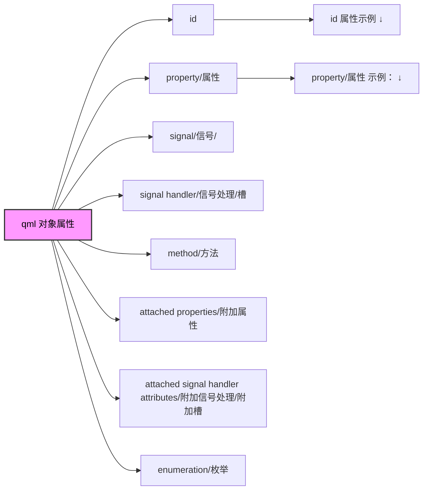

# QML 对象属性



## 1. id 属性示例：
```
import QtQuick

Item {
    id: myItem
    width: 200; height: 200
}
```

## 2. property/属性 示例：

```
[default] [final] [required] [readonly] property <propertyType> <propertyName>
```
