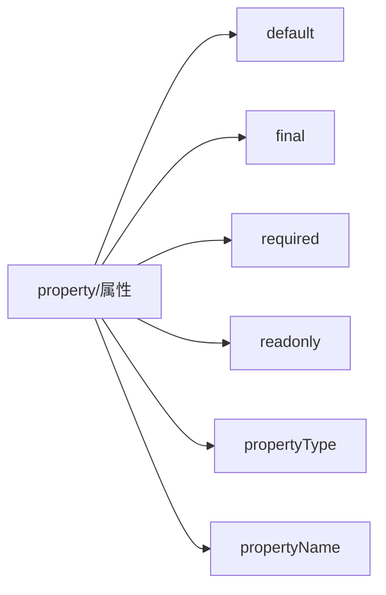

# property 属性

```
[default] [final] [required] [readonly] property <propertyType> <propertyName>
```



## 1. default关键字 与 默认属性

在 QML(Qt Modeling Language) 中，`default` 关键字用于将某个属性标记为该组件的**默认属性**。这是一个非常强大的语法糖，它允许开发者以更简洁、更直观的方式定义对象的层级结构。

### 1.1 核心概念
通常，当你向一个 QML 对象赋值时，你需要显式地指定属性名称（例如 `text: "Hello"`）。然而，如果一个属性被标记为 `default`，那么在对象定义的内部嵌套的任何未指定属性名的子对象，都会自动赋值给这个默认属性。

P.S: 如果多个未命名的子对象,自动赋值给这个默认属性的则是最后加载的一个.
P.S：一个组件只能有一个默认属性.

### 1.2 工作原理
假设你定义了一个自定义组件，并且声明了一个名为 `content` 的属性，同时将其标记为 `default`。

```qml
// MyContainer.qml
import QtQuick 2.0

Item {
    // 声明 'content' 属性并标记为 default
    default property alias content: innerItem.children

    Item {
        id: innerItem
    }
}
```

在使用这个组件时，你不需要写 `content: [ Rectangle {} ]`。你可以直接在组件内部书写子组件：

```qml
// 使用 MyContainer
MyContainer {
    // 这个 Rectangle 会自动变成 innerItem 的子对象，
    // 因为 content 是默认属性。
    Rectangle {
        color: "red"
        width: 100; height: 100
    }
}
```

### 1.3 常见应用场景
这种模式在 Qt Quick 的标准库中非常常见。例如，`Item` 或 `Rectangle` 的 `data` 属性通常也被视为默认属性机制的一部分（虽然 `Item` 的默认属性实际上是 `data`，它包括了 `resources` 和 `children`），这就是为什么你可以直接在 `Rectangle` 里面嵌套另一个 `Rectangle` 而不需要显式地写 `children: [ ... ]`。

### 1.4 为什么使用它？
1.  **代码整洁**：减少冗余代码，使 QML 结构描述更像 HTML 或 XML 的树状结构。
2.  **直观性**：让自定义控件（如布局容器、页签视图等）的使用方式看起来更像原生的 QML 容器。

### 1.5 注意事项
*   一个对象定义中只能有一个属性被标记为 `default`。
*   默认属性通常是列表类型的属性（如 `list<Item>`）或者是对象引用，以便它可以接收嵌套的 QML 元素。

### 2. final关键字
`final` 关键字用于防止属性在子类中被重写。当一个属性被声明为 `final` 时，任何试图在继承该组件的子类中重新定义该属性的行为都会导致编译错误。这对于确保某些关键属性的行为保持一致性非常有用。

它在意义上等价于 Q_PROPERTY 的 FINAL 属性。通过声明你的属性为最终， 你可以帮助 Qt 快速编译器分析你的 QML 代码。这样就能生成更好的代码。
